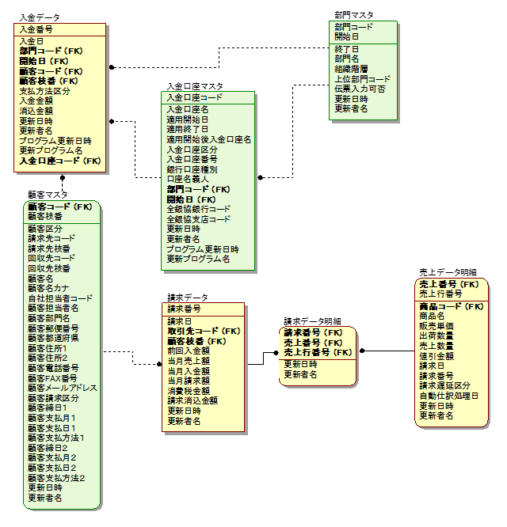

# デベロッパーファーストな Web アプリケーション基盤の作り方

## 目的

開発者が開発しやすい Web アプリケーション基盤を作りたいんじゃ！

プロジェクトの中で絶対にやること **must** と、やった方がいいこと **better** を書いていく。

## (想定する) プロジェクトのアーキテクチャ

本番稼働していないオンプレミスの受託開発です。

| 用途 | 製品名 |
| --- | --- |
| Web フレームワーク | Spring Boot |
| ビルド | Gradle |
| ORマッパー | Doma |
| テンプレートエンジン | Thymeleaf |
| DBマイグレーション | flayway |

## お詫び

テストコードは知見が乏しいので省かせていただきます。
[t_wada さんの資料](https://speakerdeck.com/twada/strategy-and-tactics-of-building-automated-testing-culture-into-organization-2020-autumn-edition) を読んで出直します。

## 開発ガイドライン

### **better** いいものをパクる

一から書いていたら時間が掛かるのでいいものを拝借します。

- 雛形は採用しているアーキテクチャが同じで本資料の **must** ができているプロジェクトからいただきましょう
- 足りない部分は [TERASOLUNA](http://terasolunaorg.github.io/) や　Fintan の [Spring アプリ開発ノウハウ集](https://fintan-contents.github.io/spring-crib-notes/latest/html/index.html) を参考になります

## URL 設計

### **better** 人が見て分かりやすい URL にする

<small>参考文献: [《REST思想》と《リソース指向》と《Webページ》を一緒にしてはいけない](https://qiita.com/irxground/items/cd83786b10d81eecce77)</small>

URL でよく見るのが `SYS10001/add` のようなプロジェクト固有の ID (プログラム ID とか 画面 ID 等と呼ばれる) です。

機械的に付けられるものの何の機能か分かりづらいので、人が見て分かりやすい URL を設計した方がよいと思います。

例えば、本の一覧を取得する機能だと以下の URL になります。

| アクション | HTTP メソッド | URL |
| --- | --- | --- |
| 一覧画面表示 | GET | /books |
| 新規登録画面表示 | GET | /books/new |
| 登録 | POST | /books/new |
| 詳細画面表示 | GET | /books/`id`/edit |
| 更新 | POST | /books/`id`/edit |
| 削除 | POST | /books/`id`/delete |

同様に Java のクラスファイルも `SYS10001Controller.java` のような ID で付けることもあります。
こちらも何の機能か分かる名前にした方がよいです。

## フレームワーク

### **must** 作ったアプリケーションを手早く起動できる

Spring Boot だと組み込み Tomcat が入っていて Tomcat のインストールや `server.xml` の `xxx` 行目を修正するみたいな作業もいりません。

Eclipse なら STS (Spring Tool Suite) というプラグインを入れれば実行ボタンをクリックするだけで Web アプリケーションが起動します。

そのためデフォルト設定で OK です。と言うよりデフォルトを変えるなということです。

### **must** ホットスワップができる

ホットスワップとは、アプリケーションを起動したまま修正が反映される仕組みです。

Spring Boot Devtools を入れるとホットスワップが有効になります。
`build.gradle` の `dependencies` に以下を追加します。

```
dependencies {
    developmentOnly("org.springframework.boot:spring-boot-devtools")
}
```

Thymeleaf のキャッシュを無効することで View の修正も起動したまま反映されます。
`application.properties` に以下を追加します。

```
spring.thymeleaf.cache=false
```

## Git

### **must** ブランチのルールを決める

リリースまでは `develop` と `feature` しか使わないので、以下のような流れになっていればいいと思います。

{図}

1. 開発のメインブランチ `develop` からワークブランチ `feature` をローカルにチェックアウトする
1. コーディングが終わればコミットし、リモートの `feature` にプッシュする
1. マージリクエストを作成し、レビューアにレビュー依頼する
1. コードレビューを行う
1. コードレビューが終われば `develop` にマージし、`feature` を削除する

### **must** マージリクエストでソースレビューできる

オンプレミスの場合だと社内に Git サーバを立てて GitLab を入れることが多いと思います。

GitLab を使用するメリットはマージリクエストというソースの変更を承認してもらう機能です。
差分の比較もしやすく、レビューコメントも付けられるのでソースレビューが捗ります。

## CI/CD

### **must** 修正内容をすぐにテストできる

結合テストが始まるとソース修正して結合テスト環境にデプロイすることが多くなるので以下の手順をジョブにしておきます。

1. `develop` からソースを取得する
1. `gradle build` を実行する
1. `BUILD SUCCESSFUL` になれば実行可能 jar (または war) が `./build/libs` に作成される
1. 実行可能 jar を Web サーバに配置して `java -jar` で実行する

ジョブにしておけば誰でもデプロイできるので、構成管理担当がいなくても結合テストを進めることができます。

### **better** お客さん環境にリリースできる

お客さんの環境次第な所もあり、対応できれば。

- 実行可能 jar の受け渡し
    - 社内ネットワークから受け渡しできるか
    - ファイル共有サービスを使用する場合は API でアップロード、ダウンロードできるか
- お客さん環境でのデプロイ
    - お客さん環境に Jenkins を入れられるか

### **must** 環境ごとに設定ファイルを自動で切り替えできる

アプリケーションプロパティは環境ごとに違うのでデプロイする時に切り替えられるようにします。

環境ごとに application.properties を作成します。

| 環境 | ファイル名 |
| --- | --- |
| 開発 | application-develop.properties |
| ステージング | application-staging.properties |
| 本番 | application-production.properties |

`java -jar` で起動する時に `-D` オプションで `spring.profiles.active` を設定します。
application-develop.properties で起動する場合は以下のようになります。

```
java -jar -Dspring.profiles.active=develop spring-boot-application.jar
```

## ER 図

### **must** エンティティ間の関係が分かる

ER 図はエンティティをリレーションシップという線で結ぶことで、エンティティ間の関係を表現しています。
エンティティ間の関係が明らかでないと SQL の結合条件や登録、更新、削除の抜け漏れが起きる可能性があります。

リレーションシップは、主キーに着目して他のエンティティの属性にそのキーが含まれていればエンティティ間に関係があるので線で結びます。



<small>出典: [ER図とは？書き方やテクニックをわかりやすく解説](https://products.sint.co.jp/ober/blog/create-er-diagram)</small>

### **must** 参照整合性チェックをシンプルで安全に行う

<small>参考文献: 「SQL アンチパターン - 4 章 キーレスエントリ (外部キー嫌い)」</small>

参照整合性は、リレーションシップを結んだエンティティ間でレコードの整合性が取れていることです。

参照整合性チェックの最もシンプルで安全な方法は外部キー制約を付けることです。

アプリケーションで参照整合性チェックをするには以下のようなデータ存在チェックが必要になります。

| 対象テーブル | 操作 | チェック処理 |
| --- | --- | --- |
| 親 | 主キーの更新 | 参照している子テーブルのレコードがないこと |
| 親 | レコード削除 | 参照している子テーブルのレコードがないこと |
| 子 | レコード追加 | 参照する親テーブルのレコードがあること |
| 子 | レコード更新 | (更新しても) 参照する親テーブルのレコードがあること |

親と子のどちらかのテーブルしか参照していない機能もあるので、設計で漏れる可能性があります。
また、設計漏れがエラーになるのは親も子も参照している機能なので、単体開発では見つかりません。

また、データ存在チェックを入れたとしても DB から直にデータを操作することもあるので、参照整合性を完全に保つことは不可能です。

外部キー制約を付ければ、アプリケーションでのデータ存在チェックは不要になりますし、不整合なレコードが作られることもありません。

### **must** カラムの桁数を決める

`VARCHAR2(4000)` や `CLOB` のような大きな桁数の場合、本当にその桁数が必要なのか本番データ等から妥当性を検証します。
また、最大桁で画面入力できるか、画面表示できるかをテストする必要があります。

## テスト

### **must** テストデータ作成を簡略できる

テストデータが用意されていると、画面を動かして確認することができますし、単体テストのデータ作成に開発者の時間が取られなくなります。

flyway は DB 作成で流すテーブル作成やデータ登録等の SQL をバージョン管理し、SQL を順番に流す作業を自動実行できるようにしたツールです。

flyway でテストデータを管理しておけば `flyway migrate` と実行するだけでテストデータが DB 登録されます。

### **better** 画面遷移のテストは単体テストで行う

下図を例に単体テストの実施範囲を考えます。

{図}

単体テストと結合テストの実施範囲を分けると以下のようになると考えます。

| 実施範囲 | 実施フェーズ | テストケース作成者 |
| --- | --- | --- |
| 画面、サーバサイドリクエスト | 単体テスト | 開発者 |
| 機能内の結合、画面遷移 | 単体テスト | 開発者 |
| 機能間の結合 | 結合テスト | 設計者 |

機能内の結合は単体テストの中で実施する方がよいと考えます。
機能内の結合は、画面やサーバサイドリクエストの入力と出力の整合性をテストするので単体テストの一つと捉える方がよいと思います。

## Appendix

### 性能問題は性能テストでは改善できません

性能問題は性能テストの段階では対策が限られてしまい、設計を見直すと大きな手戻りが起こります。
設計の見直しを含めた対策をするには単体開発の前に行う必要があります。

| 対象 | リスク | 処理 | 対策 |
| --- | --- | --- | --- |
| サーバ | レコード数の多い検索 | SELECT | 検索条件に合わせた複合インデックスの作成 |
| サーバ | 件数の多い更新 | UPDATE | 一括で UPDATE する SQL にする <br> テーブルを分割して更新テーブルのレコード数を減らす <br> ヘッダと明細のテーブルでヘッダだけを更新対象にするようにデータの持ち方を変える  |
| クライアント | 表示する件数、項目数が多い一覧 | JavaScriptライブラリでソート、ページング | サーバサイドで処理するように変更する |
